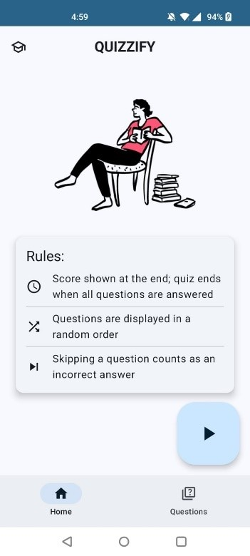
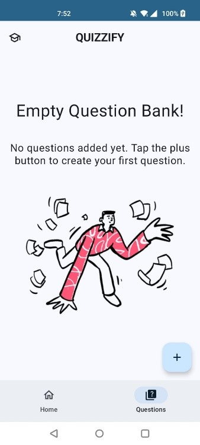
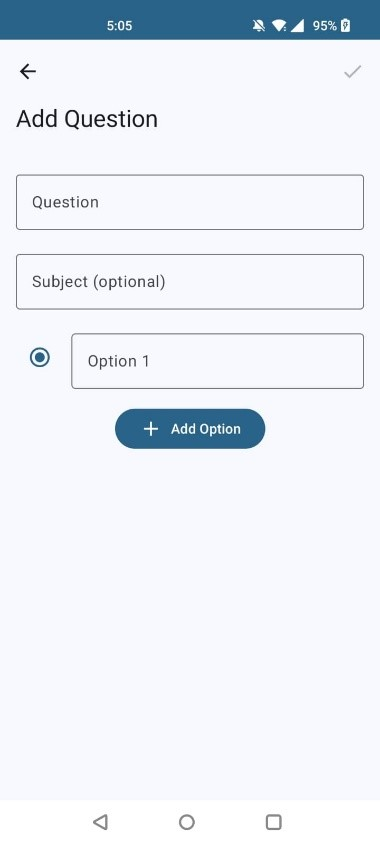
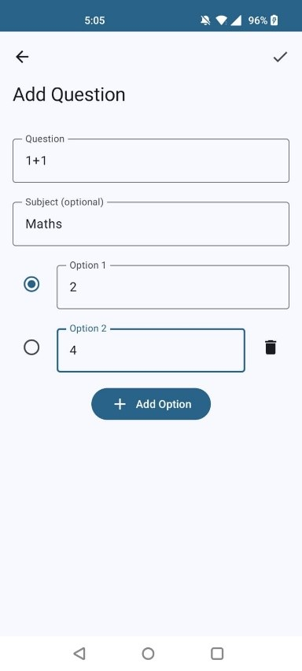
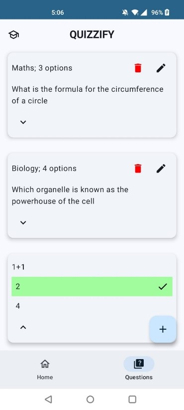
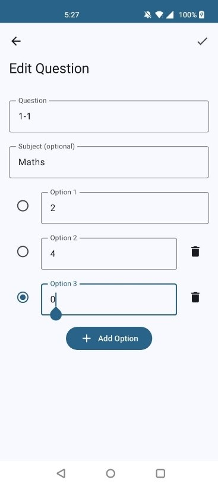
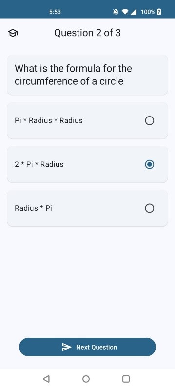
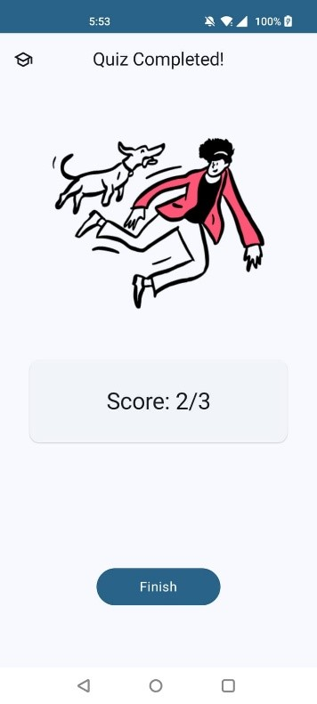

# Quizzify - Quiz Android App

Quizzify is an Android quiz application built using **Jetpack Compose** and the **Room Database**. It allows users to create, manage, and play quizzes with a modern UI that follows **Material 3 design standards**.

## Screenshots

### Landing & Navigation

  
  
  

### Add & Edit Questions

  
  
  
  

### Quiz Session & Results

  
  

## Architecture - MVVM design pattern

### Package Structure

- **`model/`**  
  Contains everything related to the `Question` entity:
    - Entity definition
    - Data Access Object (DAO)
    - ViewModel

- **`datasource/`**  
  Acts as the single source of truth for data:
    - Repository
    - Room database
    - Uses the DAO and entity from the `model` package

- **`ui/`**  
  Contains all Jetpack Compose UI screens and navigation:
    - Screens organised in subfolders
    - Navigation handled via `MainActivity.kt`
    - Reusable Compose components stored in a `components/` folder

## Technologies Used

- Kotlin
- Database: Room Database (Android's recommended abstraction layer over SQLite for local data persistence)
- UI: Jetpack Compose, Material Design 3

## Features
- Create questions with: Multiple options, a correct answer and a subject tag
- View, edit, and delete existing questions
- Play a quiz with: Randomised question order, with final score displayed at the end

## Getting Started
1. Clone the repository: `git clone http://github.com/jadenpinto/QuizzifyApp.git`
2. Open the project in Android Studio
3. Build and run the app on an emulator or physical device
